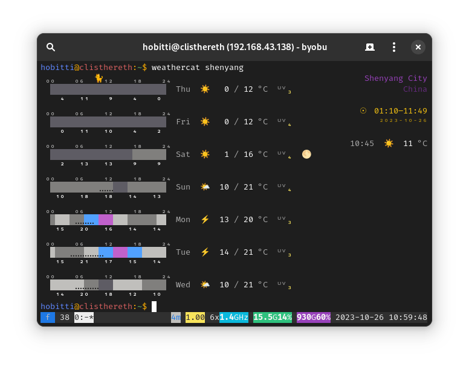

# Weathercat
Terminal weather.



## Installation
```
pip3 install "weathercat[skyfield] @ git+https://github.com/ninlith/weathercat.git"
```

## Usage
```
Usage: weathercat [-h] [-d] [-a] [LOCATION ...]

Terminal weather

positional arguments:
  LOCATION          free-form query or coordinates (geo URI or latitude, longitude)

options:
  -h, --help        show this help message and exit
  -d, --debug       enable DEBUG logging level
  -a, --autolocate  force location autodetection
```

## Configuration
`weathercat.conf` file inside a platform-specific user configuration directory.
